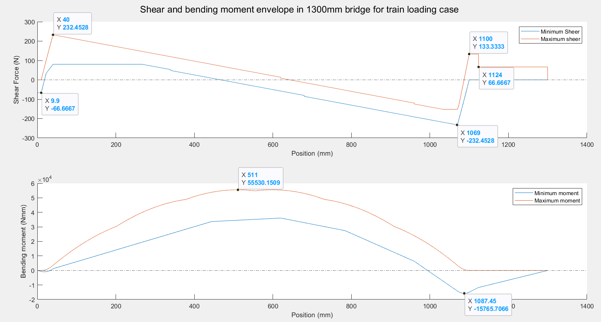

# CIV102 Shear and Bending moment enveloppes for the Matboard bridge

In our 1st year CIV102 course, our team had to design a bridge to support
a weighted model train. I determined with Matlab the shear force and bending moments
created by the train at every point along the bridge length (see below) based on the train and support dimensions.
This allowed us to reinforce our design where the highest loads occur.

